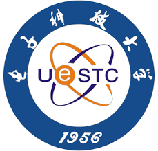

# AnalogGym

(Under Construction)

- This repository is the analog circuit synthesis testing suite, AnalogGym.
  > AnalogGym: An Open and Practical Testing Suite for Analog Circuit Synthesis \
Jintao Li, Haochang Zhi, Ruiyu Lyu, Wangzhen Li, Zhaori Bi\*, Keren Zhu\*, Yanhan Zhen， Weiwei Shan, Changhao Yan, Fan Yang, Yun Li\*, and Xuan Zeng\* \
IEEE/ACM International Conference on Computer-Aided Design (ICCAD '24), October 27--31, 2024, New York, NY, USA

